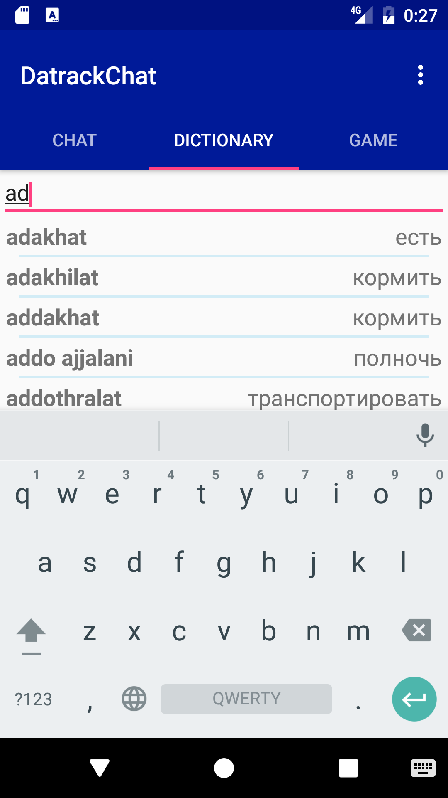

# DatractChat. Android приложение.

 
  

### Идея приложения:

Наш чат -- это новый способ коммуникации для фанатов серии фантастических раманов "Песнь Льда и Огня" и в тоже время помощник для изучения этого языка. 

Приложение состоит из трех основных частей:

#### Чат

Основной разработчик: Шахбазян Гарик

 
  
  
  

В чате поддерживают диалоги с разными пользователями, которые зарегистрированы в приложении. 
Сообщения и список диалогов обновляются автоматически в реальном времени.
Сообщение проверяется на соответсвие Дотратийскому языку. В случае ошибки слово выделяется красным предупреждая отправление неправильного сообщения. 

#### Словарь 

Основной разработчик: Шкарупин Данил 

 
  
  
  

Словарь основывается базаруется на [Wiki Dothraki](http://wiki.dothraki.org/Vocabulary) и содержит 350 слов и словосочетаний. Поддерживается поиск на разных языках. 

#### Игра "Карточки"

Основной разработчик: Трофимов Иван

 
  
  
  

Эта игра поможет легко выучить Дотракийский язык. По слову из четырех вариантов ответом Вам нужно выбрать правильно. Вы можете выбирать язык и увидеть правильный ответ в случае ошибки. 

Проект реализовали:
* Шахбазян Гарик ([gariksh97](http://github.com/gariksh97), garikshgarig@gmail.com)
* Трофимов Иван ([kekcik](http://github.com/kekcik), ivan@trofimov.mobi)
* Шкарупин Данил ([ikefir](http://github.com/ikefir), danshk1311@gmail.com)
